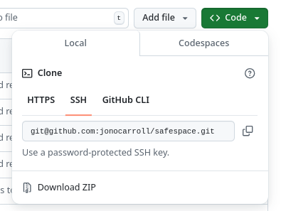

# safespace

<!-- badges: start -->
<!-- badges: end -->

The goal of safespace is to prvide safe space for new developers to try out a pull request (particularly fo [Hacktoberfest 2024](https://hacktoberfest.com/participation/)) 
for an R package where they will definitely not break any in-production code.

## Installation

You can install the development version of safespace like so:

``` r
# istall.packages(remotes)
remotes:install_github(jonocarroll/safespace)
```

## Motivation

Relevant blog post: https://jcarroll.com.au/2024/10/01/a-safe-space-for-learning-how-to-make-pull-requests/

If you're new to using `git` then it might be seem like making a pull request to someone
else's project is too complicated or at risk of breaking something. This repository 
is a _safe space_ where I encourage you to submit a pull request fixing something (
there are many intentially borken elements here just waiting for someone to suggest 
fixes for them.) - I will review your pull request ("PR") and provide mentoring if 
there's anything I think could be done differently. I will then merge the pull 
reqeust which will count towards your [Hacktoberfest 2024](https://hacktoberfest.com/participation/) tally.

I only ask that you try to fix _just one thing_ in each PR; leave some fixes for 
others, too.

## Things To Look For

- typos
- documentation (lack of, or fixes to)
- incorrect logic
- anything that `devtools::check()` flags
- improvements

At the start of October 2024, the package is in a broken state and cannot be 
installed - _can you help_? Throughout October, it may also end up in a broken 
state (intentially or not) - that's fine.

## Who Can Contribute?

This is a toy repository/package, so if you're already familiar with R and git 
then there's no benefit here for you. I'm interested in helping people who would 
like to contribute to open source packages but aren't yet confident in the pull
request process. If that's you, then please do contribute.

While not essential, I suggest registering your account to [Hacktoberfest](https://hacktoberfest.com/participation/) 
where you can claim a digital badge if you submit 4 pull requests that get merged 
to any repository with the `hacktoberfest` topic (like this one).

## How To Suggest Changes

There are many ways you could generate a pull request, but here are some that I 
use:

###  Via The GitHub Web Interface

1. Be logged in to GitHub
2. Find a file you would like to suggest changes to via the file picker
3. Click 'Edit this file' (pencil icon) in the top right corner; this will guide 
you through "forking" this repository to your own account - creating a copy of the code 
in your account which you can change without impacting the original


4. An editor will allow you to make your desired changes
21. Commit these to your fork via the 'commit' button, with a suitable message
6. At the top of the page for your fork you should either see a prompt to create 
a pull request or the 'Contribute' button


This will guide you through completing your pull request.

###  Via RStudio

1. Copy the `git` link to this repository by clicking the green 'Code' button near the top of this page



2. In RStudio select from the menu File - New Project - Version Control - Git and 
fill in the `git` link and location to store the code
3. Make your changes locally and commit them - these are still local to you and your fork
4. Push your changes to your fork
5. At the top of the page for your fork you should either see a prompt to create 
a pull request or the 'Contribute' button


This will guide you through completing your pull request.

---

## Still Stuck?

<b>If these instructions are incomplete or you have more questions, feel free to find 
me on [Mastodon](https://fosstodon.org/@jonocarroll) and ask, or start an [Issue](https://github.com/jonocarroll/safespace/issues) where you can ask questions.</b>
